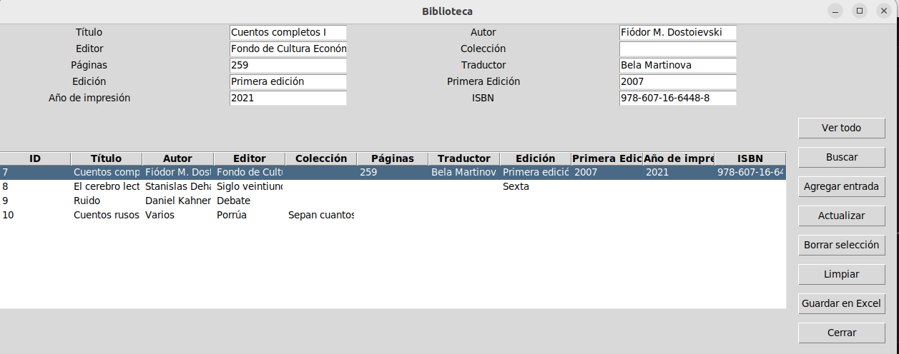

# 📚 Pybrary

Pybrary is a **book database application** built with a user-friendly Tkinter interface. It allows users to keep their collection updated and quickly consult book information, making it perfect for avid readers and librarians alike.

This application is based on a project created during the [Udemy course](https://www.udemy.com/share/107sSG3@ezy0tJALMVtD6EtNY7OaJRd6UAET5r1E75wzlr0HwkrpaSTC8czR-_2J3o3oUCYd/) by **Ardit Sulce**. 

## 🎨 Screenshots



## 🌟 Features
- Add, update, and delete book records
- Search by title, author, year of publication, and ISBN
- Export database to Excel for easy backups

## 🚀 Installation

1. Clone the repository:
```bash
git clone https://github.com/bidallei/Pybrary.git
```

2. Navigate to the project directory:
```bash
cd Pybrary
```

3. Install the required packages:
```bash
pip install -r requirements.txt
```

4. Run the application:
```bash
python main.py
```

5. Launch the application and use the interface to manage your book collection.
Click on "Agregar entrada" to insert new books, or "Buscar" to find specific titles.

## 🤝 Contributing
Contributions are welcome! Please open an issue or submit a pull request.

## 📜 License
This project is licensed under the MIT License. See the LICENSE file for details.